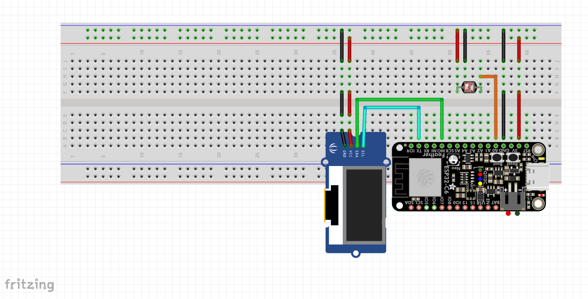

# IoT Light Monitoring System

## Overview
This project is an IoT-based light monitoring system built with an ESP32, a light sensor module, and a 0.96-inch OLED display. The system continuously reads the ambient light level and visualizes the result on the OLED using a live progress bar at the top and a status message at the bottom. When the room becomes too dark for comfortable screen usage, the message changes dynamically to warn the user, and the project can be extended with an LED, buzzer, or mobile notification.

The main goal is to encourage better lighting conditions during screen use and help reduce eye strain. The current implementation focuses on local monitoring and visual feedback, while the next step is to add stronger alert mechanisms and optional remote notifications.

### Board and schematic note
The firmware and wiring target an **ESP32 XX5R69** development board. The schematic diagram uses an **ESP32-C6** symbol only because of limitations in the schematic software (the part library did not offer a better match for this PCB). The real build uses the **XX5R69** board, not an ESP32-C6.

**Actual wiring on the assembled board** (labels as on the modules):

| Connection | ESP32 pin |
|------------|-----------|
| Light sensor **AO** | **D2** (GPIO 2) |
| OLED **MO** | **D22** |
| OLED **TX** | **D23** |

Power and ground follow the same net names as in the diagram (**3.3V**, **GND**).

## Schematics Plan
The schematic below shows the current hardware plan for the project.

### Pin connections (reference — diagram uses ESP32-C6 symbol; see board note above)
#### ESP32 ↔ Light sensor module
- **3.3V** → **VCC**
- **GND** → **GND**
- **D2 (GPIO 2, analog read)** ↔ **AO**

#### ESP32 ↔ 0.96" OLED display (I2C)
- **3.3V** → **VCC**
- **GND** → **GND**
- **D22** ↔ **MO**
- **D23** ↔ **TX**

#### Optional extension components
- **GPIO 25** → LED indicator (through a **220Ω** resistor)
- **GPIO 26** → buzzer

## Pre-requisites

### Hardware components
- **ESP32 XX5R69 development board** (same family as in the build; schematic diagram shows ESP32-C6 only as a stand-in—see *Board and schematic note* above)

- **0.96-inch OLED display (SSD1306, I2C, 128x64)**  
  Example controller page: <https://www.adafruit.com/product/326>

- **Light sensor module with photoresistor (LDR) and analog output**
- **Breadboard**
- **Dupont jumper wires**
- **Micro USB cable**
- **Optional:** LED, buzzer, 220Ω resistor

### Software components
- **Arduino IDE**  
  <https://www.arduino.cc/en/software>

- **ESP32 board package for Arduino**  

- **Adafruit SSD1306 library**  

- **Adafruit GFX library**  

## Setup and Build Plan

### What is already done
1. The ESP32 board is connected and powered through USB.
2. The light sensor module is wired to the ESP32 and its analog value can be read in code.
3. The OLED display is wired through I2C and successfully displays custom text.
4. The display logic was extended to show:
   - a **live progress bar** in the top colored zone,
   - a **dynamic text message** in the lower zone based on light level thresholds.
5. Calibration values were tested manually:
   - around **1200** for strong/direct light,
   - around **1800** when the sensor is fully covered.

### Current threshold plan
- **0–39%** → **INTUNERIC!**
- **40–59%** → **SLAB**
- **60–79%** → **OK**
- **80–100%** → **FOARTE BUN**

### What we plan to do next
1. Add an LED indicator for visual warning when the environment is too dark.
2. Add a buzzer for an audio alert below a defined threshold.
3. Refine the calibration so the percentage mapping is more stable in different rooms.
4. Improve the OLED interface with smoother updates and better spacing.
5. Optionally send a notification to a connected mobile application.

## Running

### Upload and run
1. Connect the ESP32 to the computer using the Micro USB cable.
2. Open the project in Arduino IDE.
3. Make sure the correct board and serial port are selected.
4. Upload the source code to the ESP32.
5. Open the Serial Monitor if you want to inspect the raw sensor values.

### Expected behavior
1. The OLED display turns on after startup.
2. The top area of the OLED shows a live bar representing the current light level.
3. The bottom area shows a dynamic text message:
   - **INTUNERIC!**
   - **SLAB**
   - **OK**
   - **FOARTE BUN**
4. When the sensor is covered, the bar should drop and the status should move toward the darker-light warnings.
5. When exposed to stronger light, the bar should increase and the status should improve.

## Project Results
At this stage, the project already demonstrates the core functionality of ambient light monitoring with live visual feedback. The ESP32 reads the sensor values correctly, maps them to a percentage interval, and updates the OLED display in real time. The next iteration will focus on alerts and polishing the user experience so the project becomes a more complete smart safety assistant for screen usage.
